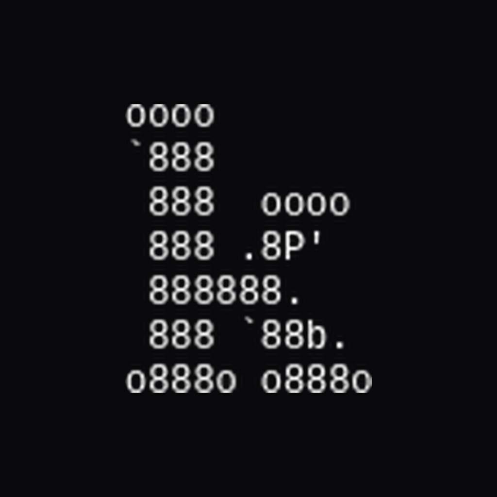

<div align="center">
  
  <h1>Komunikasi</h1>
  <p><strong>Real-time messaging, one codebase, web and native Android.</strong></p>
  <p>
    <a href="CHANGELOG.md">Changelog</a> ·
    <a href="docs/">Docs</a> ·
    <a href="https://dbdiagram.io/d/komunikasi-67f935074f7afba184451999">ERD</a>
  </p>
</div>

---

## Contents

| | |
|---|---|
| [Quick start](#quick-start) | [Architecture](#architecture) |
| [What's inside](#whats-inside) | [Native Android](#native-android) |
| [Push](#push-notifications) | [Testing](#testing) |
| [Tooling](#tooling) | [Reference](#reference) |

---

## Quick start

Needs **Node 20+**, a PostgreSQL database, and a Pusher app.

```console
$ git clone https://github.com/thirapi/keep-clean-komunikasi.git
$ cd keep-clean-komunikasi
$ npm install
$ cp .env.example .env          # 20 variables, each documented
$ npm run db:push               # apply schema
$ npm run db:seed               # optional: dev users
$ npm run dev
```

<http://localhost:3000>

Only `DATABASE_URL`, `PUSHER_*` and `R2_*` are needed to boot. Everything else
degrades gracefully — no push keys means no notifications, not a broken app.

---

## What's inside

**Messaging**
: Channels and DMs, replies, threads, attachments, reactions, read receipts,
  typing indicators. Lexical rich text with `@mention` tokens, optimistic UI
  reconciled against the server, and an IndexedDB cache so a room paints from
  cache before the network answers.

**Realtime**
: Pusher carries messages, reactions, deletions and typing. Presence is
  WebSocket-backed through a Redis index, so it survives multiple tabs and
  devices.

**Push**
: Web Push for browsers, Firebase Cloud Messaging for the app. Both stored, both
  delivered, neither shadowing the other.

**Accounts**
: Rotating session cookies, roles and permissions, impersonation for support,
  profile editing, custom emoji with shortcodes.

**Platform**
: Server-rendered App Router, installable PWA, native Android shell, dark and
  light themes.

---

## Architecture

Clean Architecture, with dependencies pointing inward. Each layer may only know
about the one above it.

```
   src/app/                routes · layouts · server actions
        │
        │   Action → Controller → Use Case → Repository / Service
        ▼
   interface-adapters/     controllers          validate, delegate
        ▼
   application/            use cases            business logic
        │                  repositories / services   (interfaces only)
        ▼
   infrastructure/         implementations      Drizzle · Pusher · R2 · Redis
        ▲
   entities/               types and DTOs       no logic
```

**The five rules**

```console
[1]  Frontend never bypasses a layer.       Action → Controller → Use Case
[2]  A use case never calls a use case.
[3]  No business logic in a controller,
     an action, or a repository.
[4]  Class-based everywhere, except
     controllers (functions) and actions.
[5]  Dependencies arrive through constructors.
     A service with a second implementation
     gets an interface first.
```

Wiring happens once, in the controller — never in a route:

```ts
// interface-adapters/controllers/users/search.controller.ts
const userRepository = new UserRepository(db);
const searchUserUseCase = new SearchUserUseCase(userRepository);

export async function searchUserController(query: string, limit?: number) {
  return await searchUserUseCase.execute(query, limit);
}
```

The rationale for each non-obvious decision is written down in `docs/`, and those
documents are standards the code is expected to follow — not post-mortems.

---

## Native Android

The Android app is a Capacitor shell around the deployed web app.

> **Why it loads a URL instead of a bundle.** A static export is not possible
> here. The app exposes 53 Server Actions across 12 `"use server"` modules, and
> Server Actions only execute against a live Next.js server — a static export
> would strip the entire data layer. Loading the deployment keeps the backend
> untouched and every action working.

What the shell adds that a browser tab cannot:

- Hardware **back** navigates the stack instead of leaving the app
- Status bar follows the theme, and stays opaque
- Body resizes for the keyboard, so the input is never covered
- Native launch screen
- Haptics on message sent and received

```console
$ npm run cap:sync
$ npm run cap:run:android
```

Building an APK needs the Android SDK and a JDK — **not** macOS or Xcode. Full
setup in [`docs/native-app.md`](docs/native-app.md).

---

## Push notifications

Two transports, one table, routed per row:

| `type` | Transport | Reaches |
|:--|:--|:--|
| `web` | VAPID (Web Push) | browsers, desktop |
| `fcm` | Firebase Cloud Messaging | native Android |

> **FCM is delivered by Google Play Services.** Devices without GMS — Huawei
> above all — can never receive it, and that is not something the server can
> fix. Web Push remains their transport, so nobody loses notifications.

Dead tokens (`UNREGISTERED`, `INVALID_ARGUMENT`) are deleted so the table stops
growing and sends stop retrying them. Transient failures keep the token.

---

## Testing

```console
$ npm test
 ✓ 8 files · 59 tests

$ npm run lint
$ npx tsc --noEmit
```

Covers use cases against mocked repositories, password hashing including
backwards compatibility of hashes written by the previous implementation,
the presence index and its stale-entry pruning, and push transport routing.

The sidebar projection is checked against a **real Postgres**, not a mock:

```console
$ npm run verify:sidebar
ALL CHECKS PASSED
```

---

## Tooling

Every performance figure this project claims is reproducible. Nothing is taken
on trust.

```console
$ npm run measure:bundle
```

```console
route                            chunks   raw KB   gzip KB
------------------------------------------------------------------------
(with-sidebar)/channels/[roomId]      18    1351.0      414.4
admin/(with-sidebar)/users            17     722.5      212.6
/ (landing)                           12     555.7      169.5
...
TOTAL across routes                         8546.1     2568.9
```

It reads the client-reference manifest, whose `async` flag separates chunks that
load eagerly from those behind a dynamic import — so it reports what a browser
actually pays for, not total static output.

| Command | Answers |
|:--|:--|
| `measure:bundle` | What does a browser download before the page is usable? |
| `measure:sidebar` | How many statements, how many milliseconds? |
| `verify:sidebar` | Is the result actually correct? |
| `measure:markdown` | What does each remark/rehype plugin cost? |
| `measure:password` | How long does hashing block the event loop? |
| `bench:content` | CPU cost of the message render path. |

---

## Reference

<details>
<summary><b>Environment variables</b></summary>

Required to boot:

| Variable | Purpose |
|:--|:--|
| `DATABASE_URL` | PostgreSQL connection string |
| `PUSHER_APP_ID` `PUSHER_SECRET` | Realtime |
| `NEXT_PUBLIC_PUSHER_KEY` `NEXT_PUBLIC_PUSHER_CLUSTER` | Realtime, client |
| `R2_ACCOUNT_ID` `R2_ACCESS_KEY_ID` `R2_SECRET_ACCESS_KEY` `R2_BUCKET_NAME` `R2_PUBLIC_DOMAIN_URL` | File uploads |
| `UPSTASH_REDIS_REST_URL` `UPSTASH_REDIS_REST_TOKEN` | Presence |

Optional:

| Variable | Purpose |
|:--|:--|
| `NEXT_PUBLIC_VAPID_PUBLIC_KEY` `VAPID_PRIVATE_KEY` | Web Push, browsers |
| `FIREBASE_PROJECT_ID` `FIREBASE_CLIENT_EMAIL` `FIREBASE_SERVICE_ACCOUNT_JSON` | FCM, native push |
| `DISCORD_WEBHOOK_URL` | New-message notifications |
| `NEXT_PUBLIC_APP_URL` | Public origin, avoids proxying R2 twice |

</details>

<details>
<summary><b>Layout</b></summary>

```console
src/
├── app/                    routes, layouts, server actions
├── components/             UI
│   ├── ui/                 shadcn/ui primitives
│   ├── lexical/            editor plugins
│   └── native-shell*       Capacitor integration
├── hooks/                  reusable hooks
├── lib/
│   ├── entities/           types and DTOs
│   ├── application/        use cases, ports
│   ├── interface-adapters/ controllers
│   ├── infrastructure/     repository and service implementations
│   └── native/             native platform helpers
└── utils/

docs/       feature and design documents
drizzle/    schema migrations
scripts/    build, measurement, maintenance
```

</details>

<details>
<summary><b>Scripts</b></summary>

| | |
|:--|:--|
| `dev` `build` `start` | Next.js |
| `lint` `test` | ESLint, Vitest |
| `db:push` `db:generate` `db:seed` `db:reset` `db:studio` | schema and data |
| `cap:sync` `cap:open:android` `cap:run:android` `cap:open:ios` | native |
| `measure:*` `verify:*` `bench:*` | performance and correctness |

</details>

<details>
<summary><b>Design documents</b></summary>

| Document | Covers |
|:--|:--|
| [mark-as-read](docs/mark-as-read.md) | Throttled read state, multi-device sync |
| [column-reverse-architecture](docs/column-reverse-architecture.md) | CSS-only chat anchoring, no JS scroll math |
| [indexeddb-sync](docs/indexeddb-sync.md) | Local-first message cache |
| [lexical-editor](docs/lexical-editor.md) | Editor architecture, mention nodes |
| [native-app](docs/native-app.md) | Capacitor shell, push setup |
| [optimistic-ui-flow](docs/optimistic-ui-flow.md) | Optimistic updates and reconciliation |
| [custom-emojis](docs/custom-emojis.md) | Shortcodes, R2-hosted emoji |
| [account-filtering](docs/account-filtering.md) | Mute, intensity reduction |
| [fediverse-implementation](docs/fediverse-implementation.md) | ActivityPub |
| [federation-whitelist-strategy](docs/federation-whitelist-strategy.md) | Inbox filtering vs outbound fetch |
| [post-actions](docs/post-actions.md) | Like, repost, quote, bookmark |
| [ui-design-standards](docs/ui-design-standards.md) | Visual conventions |

</details>

---

<div align="center">
  <sub>Private project · All rights reserved · <a href="https://github.com/thirapi">Thirafi</a></sub>
</div>
